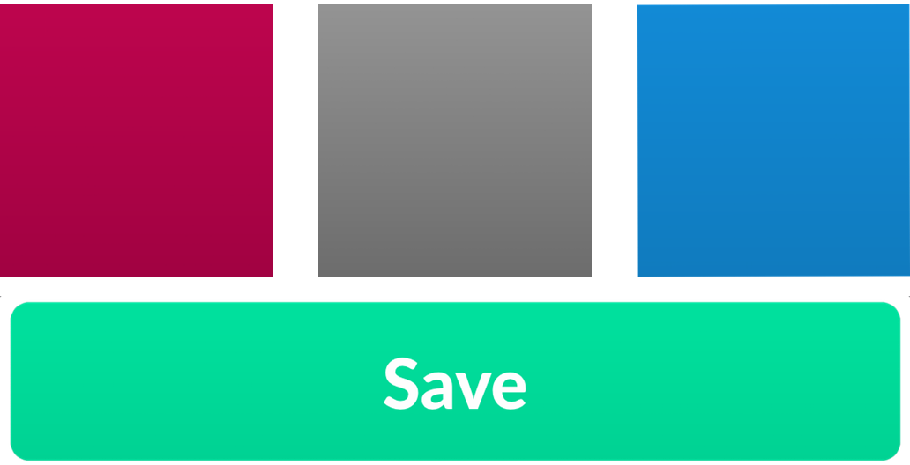

# Slope

#### Flat is out, so let's make depth easy.

---

[](https://cocoapods.org/)

 


### Gradients are coming back in style, so let's party like it's 1989 again. 

Use them for backgrounds, use them for UI elements, use them to make yourself happy.



---

The built in `CAGradientLayer` API is overly complex, doesn't work with auto layout, and is very fiddly. 

Using Slope is simple.

Simple is better than complex!

#### Let's build a gradient view like above:

```swift
import Slope

let gradientView = GradientView()
gradientView.gradient = UniformGradient(colors: [.darkGrayColor, .lightGrayColor])
```

There is no step 2. You now have a `UIView` subclass that you can add to your screen.

#### Let's build the save button above:

We're going to make it a little nicer by adding a highlighting effect when you touch down.

```swift
final class GradientButton: UIControl {

    let titleLabel: UILabel = {
        let label = UILabel()
        label.textColor = UIColor.white
        label.font = UIFont.systemFont(ofSize: 24.0)
        label.textAlignment = .center

        return label
    }()

    override var tintColor: UIColor! {
        didSet {
            self.backgroundColor = self.tintColor
            self.highlightedColor = self.tintColor.darkened(byPercentage: 0.1)
            
            let lightGreen = #colorLiteral(red: 0, green: 0.8235294118, blue: 0.5764705882, alpha: 1)
            self.backgroundGradientView.gradient = PercentageGradient(baseColor: lightGreen, direction: .lightToDark, percentage: 0.06)
        }
    }

    private let backgroundGradientView = GradientView()

    private var highlightedColor: UIColor?

    // MARK: Initializers

    override init(frame: CGRect) {
        super.init(frame: frame)

        self.setup()
    }

    @available(*, unavailable)
    required init?(coder aDecoder: NSCoder) {
        fatalError("init(coder:) has not been implemented")
    }

    // MARK: Touch down effects

    override func touchesBegan(_ touches: Set<UITouch>, with event: UIEvent?) {
        super.touchesBegan(touches, with: event)

        self.backgroundColor = self.highlightedColor
        self.backgroundGradientView.tintColor = self.highlightedColor ?? self.tintColor
    }

    override func touchesEnded(_ touches: Set<UITouch>, with event: UIEvent?) {
        super.touchesEnded(touches, with: event)

        self.backgroundColor = self.tintColor
        self.backgroundGradientView.tintColor = self.tintColor
    }

    override func touchesCancelled(_ touches: Set<UITouch>, with event: UIEvent?) {
        super.touchesCancelled(touches, with: event)

        self.backgroundColor = self.tintColor
        self.backgroundGradientView.tintColor = self.tintColor
    }
}

private extension GradientButton {

    func setup() {
        self.addSubview(self.backgroundGradientView)
        self.backgroundGradientView.pinToSuperview()

        self.addSubview(self.titleLabel)

        self.setupConstraints()
    }

    func setupConstraints() {
        self.backgroundGradientView.translatesAutoresizingMaskIntoConstraints = false

        let backgroundConstraints = [
            self.backgroundGradientView.leadingAnchor.constraint(equalTo: self.leadingAnchor),
            self.backgroundGradientView.trailingAnchor.constraint(equalTo: self.trailingAnchor),
            self.backgroundGradientView.topAnchor.constraint(equalTo: self.topAnchor),
            self.backgroundGradientView.bottomAnchor.constraint(equalTo: self.bottomAnchor)
        ]
        
        NSLayoutConstraint.activate(backgroundConstraints)

        self.titleLabel.translatesAutoresizingMaskIntoConstraints = false

        let titleLabelConstraints = [
            self.titleLabel.leadingAnchor.constraint(equalTo: self.leadingAnchor),
            self.titleLabel.trailingAnchor.constraint(equalTo: self.trailingAnchor),
            self.titleLabel.topAnchor.constraint(equalTo: self.topAnchor),
            self.titleLabel.bottomAnchor.constraint(equalTo: self.bottomAnchor)
        ]
        
        NSLayoutConstraint.activate(titleLabelConstraints)
    }

}
```

And voilà, a beautiful gradient button with highlighting that you can reuse across your app.

---

#### Types of Gradients

There are two current types of gradients, `UniformGradient` and `PercentageGradient`. 

You can create your own as you see fit by conforming to the `Gradient` protocol.

- If you want to make a radial gradient, go wild. 
- If you want to make a diagonal gradient, that works too. 
- If you come up with something creative, contribute to the project!


## Installation
You can use [CocoaPods](http://cocoapods.org/) to install `Slope` by adding it to your `Podfile`:

```swift
platform :ios, '9.0'
use_frameworks!

pod 'Slope'
```

Or install it manually by downloading `Gradient.swift`, `UniformGradient.swift`, `PercentageGradient.swift`, and `GradientView.swift`, and dropping them in your project.

## About me

Hi, I'm [Joe](http://fabisevi.ch) everywhere on the web, but especially on [Twitter](https://twitter.com/mergesort).

## License

See the [license](LICENSE) for more information about how you can use Slope.

## Is that it?

Yep, that's it. Good night, and have a pleasant tomorrow.
